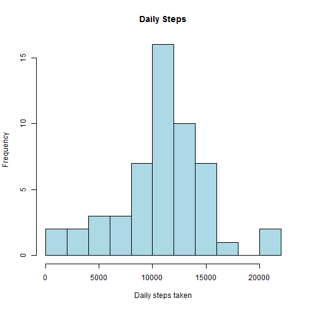
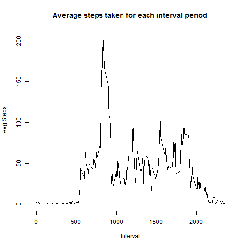
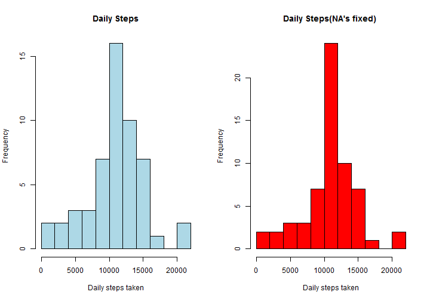
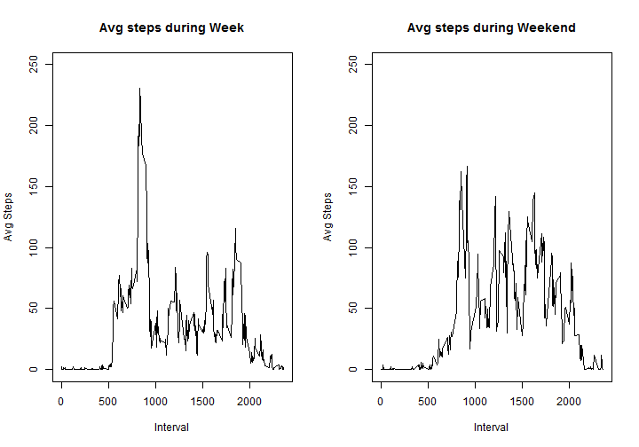

# Reproducible Research: Peer Assessment 1

## Introduction (copied from course assingment)

It is now possible to collect a large amount of data about personal movement using activity monitoring devices such as a Fitbit, Nike Fuelband, or Jawbone Up. These type of devices are part of the “quantified self” movement – a group of enthusiasts who take measurements about themselves regularly to improve their health, to find patterns in their behavior, or because they are tech geeks. But these data remain under-utilized both because the raw data are hard to obtain and there is a lack of statistical methods and software for processing and interpreting the data.

This assignment makes use of data from a personal activity monitoring device. This device collects data at 5 minute intervals through out the day. The data consists of two months of data from an anonymous individual collected during the months of October and November, 2012 and include the number of steps taken in 5 minute intervals each day.


## Loading and preprocessing the data

The data can be found from 
[Activy Data Set](https://d396qusza40orc.cloudfront.net/repdata%2Fdata%2Factivity.zip)

Read the activity data into a myData Variable.


```r
myData<-read.csv("activity.csv")
```


## What is mean total number of steps taken per day?

We get the daily totals, that will be used in our analysis.


```r
daily<-aggregate(x=myData$steps,by=list(myData$date),sum)
```


A histogram plot of the daily steps taken


```r
hist(daily$x,xlab="Daily steps taken",main="Daily Steps",breaks=8,col="LightBlue")
```

 

The mean of the daily steps is: 


```r
mean(daily$x,na.rm=TRUE)
```

```
## [1] 10766
```

The median of the daily steps is:


```r
median(daily$x,na.rm=TRUE)
```

```
## [1] 10765
```


## What is the average daily activity pattern?

We need to first get a dataset that shows us the average steps taken by Interval. I remove NA's in the dataset as mean doesn't like them.


```r
avgint<-aggregate(x=myData$steps[!is.na(myData$steps)],by=list(myData$interval[!is.na(myData$steps)]),mean)
```

Now I can draw a Line plot showing the average steps taken on each interval.


```r
plot(x=avgint$Group.1,y=avgint$x,type="l",
     xlab="Interval",ylab="Avg Steps", 
     main="Average steps taken for each interval period")
```

 


The interval with the max average steps taken is:


```r
# Just testing the substitution ouput, so I assign my results
# to variable.
maxNumber <- max(avgint$x)
maxInterval <-avgint[which.max(avgint$x),1]
```

The max avg steps taken is **206.1698** that happens on interval **835**

## Inputing missing values

There are many NA's in the dataset, which may scew results.


```r
sum(is.na(myData$steps))
```

```
## [1] 2304
```

To fix this, I will replace all NA data with the average for that time interval where the steps are NA.


```r
#I want to use a copy of myData
cMyData<-myData
#Match on interval in avgint, and return the average interval value(x) in the 
#cMydata field. Do this only on fields that contain NA's.
cMyData[is.na(cMyData$steps),"steps"] <- 
            avgint[match(cMyData$interval[is.na(cMyData$steps)],avgint$Group.1),"x"]
```

To see if there are what the differences are, I will Total up the daily steps again.


```r
newDaily<-aggregate(x=cMyData$steps,by=list(cMyData$date),sum)
```

Comparative Histograms of the two datasets


```r
par(mfrow=c(1,2))
hist(daily$x,xlab="Daily steps taken",main="Daily Steps",breaks=8,col="LightBlue")
hist(newDaily$x,xlab="Daily steps taken",main="Daily Steps(NA's fixed) ",breaks=8,col="Red")
```

 

The graph has a similar distribution, with slight changes


```r
meanOrg<-mean(daily$x,na.rm=TRUE)
meanNew<-mean(newDaily$x,na.rm=TRUE)
print(paste("Original Mean:",meanOrg,"Adjusted Mean:",meanNew))
```

```
## [1] "Original Mean: 10766.1886792453 Adjusted Mean: 10766.1886792453"
```
The adjustment had zero impact on the Mean


```r
medOrg<-median(daily$x,na.rm=TRUE)
medNew<-median(newDaily$x,na.rm=TRUE)
print(paste("Original Median:",medOrg,"Adjusted Median:",medNew))
```

```
## [1] "Original Median: 10765 Adjusted Median: 10766.1886792453"
```
Only a slight change in the median.

Overall, changing the values according to using the other historic data averages doesn't seem to have a hugh impact on the overall dataset.So, we can assume that using that the activity data follows a similar pattern.

## Are there differences in activity patterns between weekdays and weekends?

I am looking to see if the activity over weekends differ from activity over weekdays.

For this, I need to compute the daily average intervals, and categorise them accoring to weekdays. Which I will futher factorise into weekend and week.For this data, I will be using the new dataset, where I replaced the NA's.


```r
#Create a weekdays variable with the weekdays filled in
cMyData$Weekdays<-weekdays(as.Date(cMyData$date))
#Find saturday and sunday and replace with Weekend
cMyData$Weekdays[cMyData$Weekdays %in% c("Saturday","Sunday")]<-"Weekend"
#Replace everything that doesn't say Weekend with Week
cMyData$Weekdays[!cMyData$Weekdays %in% c("Weekend")]<-"Week"
cMyData$Weekdays<-factor(cMyData$Weekdays)
nAvgint<-aggregate(x=cMyData$steps,
                   by=list(WeekDays=cMyData$Weekdays,Interval=cMyData$interval),
                   mean)

par(mfrow=c(1,2))
plot(nAvgint$Interval[nAvgint$WeekDays=="Week"],
     nAvgint$x[nAvgint$WeekDays=="Week"],
     type="l",
     xlab="Interval",ylab="Avg Steps", 
     main="Avg steps during Week",ylim=c(0,250)
     )
plot(nAvgint$Interval[nAvgint$WeekDays=="Weekend"],
     nAvgint$x[nAvgint$WeekDays=="Weekend"],
     type="l",
     xlab="Interval",ylab="Avg Steps", 
     main="Avg steps during Weekend",ylim=c(0,250)
     )
```

 


